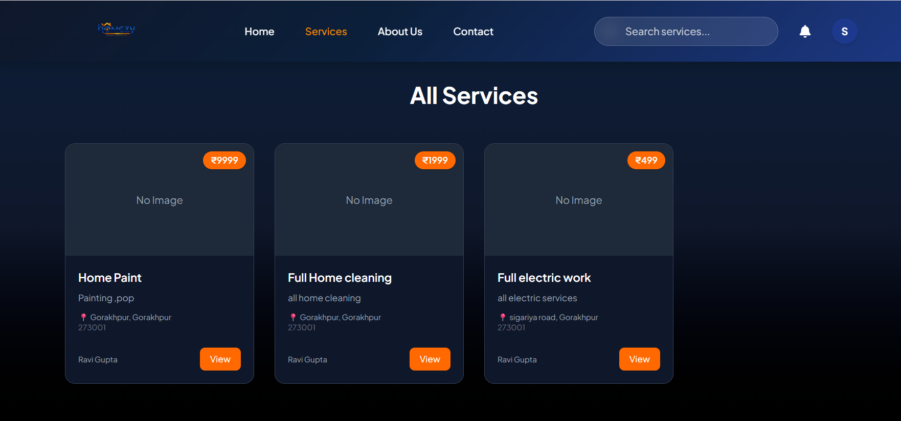
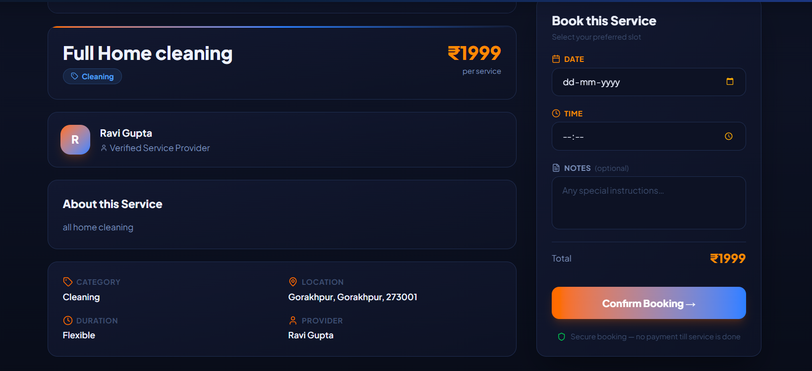

<div align="center">

<p align="center">
  
</p>


### **🚀 Book Trusted Home Services in Seconds**

*A scalable full-stack platform connecting users with verified local professionals using real-time, location-aware discovery*

<br/>

[](https://nodejs.org/)
[](https://react.dev/)
[](https://www.mongodb.com/)
[](https://expressjs.com/)
[](https://tailwindcss.com/)
[](https://jwt.io/)
<br/>
[](https://homezy.vercel.app)
[](https://github.com/shreyatiwari24/Homezy-MERN-Project/issues)
[](https://github.com/shreyatiwari24/Homezy-MERN-Project/issues)

</div>

---

## 🏠 Overview

**HomeEzy** is a **production-ready, full-stack service booking platform** built using the **MERN stack**, designed to simplify how users discover and book local service professionals.

It enables users to search, filter, and schedule services such as electricians, plumbers, and cleaners using **real-time location-based discovery**.

> 💡 **Core Problem:** Fragmented and unreliable service discovery  
> ✅ **Solution:** A centralized, scalable platform with seamless booking and secure interactions

---

## ⚡ Why This Project Stands Out

- 🧠 **System Design Thinking** → Modular backend with scalable REST architecture  
- 🔐 **Security First** → JWT authentication + bcrypt hashing  
- 📍 **Location Intelligence** → Map-based filtering improves discovery efficiency  
- ⚡ **Performance Optimized** → Efficient API design and database queries  
- 📱 **Production UI/UX** → Fully responsive and user-friendly  

---

## ✨ Key Features

- 🔐 Secure authentication with JWT and protected routes  
- 📍 Geo-based service discovery using map integration  
- 🧑‍🔧 Multi-category service booking (10+ categories)  
- 📅 Booking lifecycle management (create, update, cancel)  
- 👤 Personalized user dashboard  
- 🔍 Advanced filtering (category, price, availability)  
- 📡 RESTful API architecture  
- 🛡️ Input validation and secure backend handling  

---

## 🏗 System Architecture (High-Level)

- **Client:** React (component-driven UI)  
- **Server:** Express.js (API + middleware)  
- **Database:** MongoDB (NoSQL, scalable)  
- **Auth Layer:** JWT middleware for protected routes  

---

## 🛠 Tech Stack

**Frontend:** React, Tailwind CSS, Axios  
**Backend:** Node.js, Express.js  
**Database:** MongoDB  
**Auth:** JWT, bcrypt  
**Tools:** Git, GitHub, Postman  
**Deployment:** Vercel  

---

## 🗃 Database & DevOps

**MongoDB Atlas:** Cloud-hosted NoSQL database    
**dotenv:** Secure environment variable management  
**Postman:** API testing and documentation    

---

## 📸 Screenshots

### 🏠 Home Page


### 🔧 Services Page


### 📅 Booking Page


## ⚡ Performance Highlights

- 📍 Improved service discovery efficiency using location filtering  
- 🔐 Secure authentication reduced unauthorized access risks  
- ⚡ Optimized API response times with structured backend logic  
- 📱 Fully responsive UI across all devices  
- 🧠 Clean MVC architecture enabling scalability and maintainability  

---

## 🚀 What This Project Demonstrates

- ✔ Full-stack development (MERN)  
- ✔ Real-world problem solving  
- ✔ Backend API design & security  
- ✔ Database modeling & relationships  
- ✔ System thinking and scalability  

---

## 🗺 Roadmap

- [x] Authentication system  
- [x] Booking functionality  
- [x] Location filtering
- [x] Reviews & ratings system  
- [ ] Payment integration (Razorpay/Stripe)  
- [ ] Real-time notifications (Socket.io)    
- [ ] Admin dashboard  

---
## ⚙️ Installation & Setup

1. Clone the repository
```bash
git clone https://github.com/shreyatiwari24/Homezy-MERN-Project.git
```
2. Navigate to project folder
```bash
cd homeezy
```
3. Install dependencies
 ```bash
npm install
```
4. Create a .env file in root and add:
 ```bash
MONGO_URI=your_mongodb_connection_string
JWT_SECRET=your_secret_key
```
6. Run the project
```bash
npm run dev
```

## 👨‍💻 Author

**Shreya Tiwari**  
Full Stack Developer | MERN Stack | DSA Enthusiast 

[LinkedIn](https://linkedin.com/in/shreyatiwari24) • [GitHub](https://github.com/shreyatiwari24)

---

## ⭐ Support

If you found this project useful, consider giving it a ⭐ on GitHub!